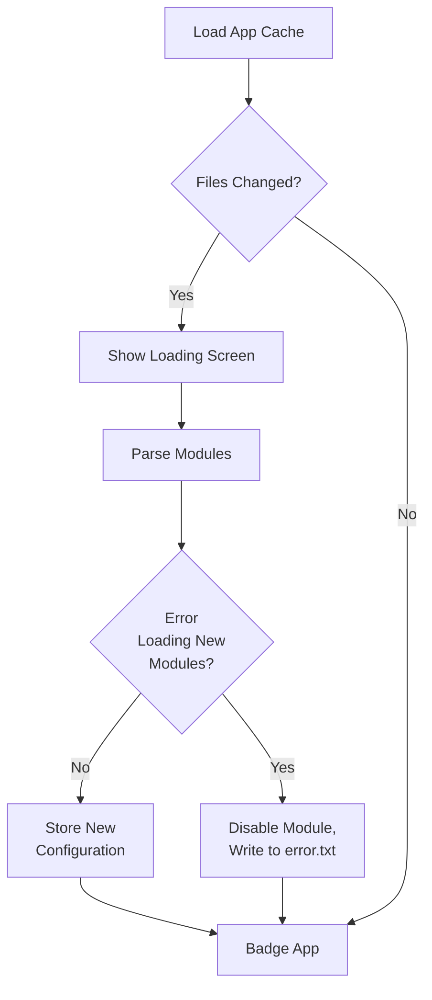

# Architecture Diagrams

## Module/App Design Constructors

- Files (also called modules) in the `apps/` folder will be auto-ingested for potential apps to run
- A module can have multiple apps
- Apps MUST inherit from the base class
- App minimum requirements are very light
- Base App class will provide
  - Automatic app registration (thanks to app directory)
  - Automatic serialization/deserialization of configs
    - Not required to use, but helps group configs for UI and web based config edits
    - (Not Done) Support for displaying in apps menu with custom icons and names
    - (Not Done) Abstracted registraiton functions for button handling and other hardware based callbacks that can be automatically de-registered as well

## Button Constructs

- Long presses are good for "exiting" context
- Should be used minimally
- Should come up with unified button handling that is mostly outside of app control for existing an app/going back to the menu

## Main Startup Sequence

## Config

- The base app provides a `Config` object that can allow the apps to be dynamically configured via the `/config` 
endpoint. When an app is open, the endpoint can be visited and any app settings that were registered can be adjusted. 
The `analog_clock.py` shows an example of this. Currently basic types like `str` and `int` are supported, as well as 
various smart config objects. Check out `lib/smart_config.py` for more information. The base `SmartConfig` class is
itself a dictionary for easy serialization and deserialization to a JSON config file
- Smart Config Types
  - `EnumConfig`: Allows you to specify a config object form a list of options. Renders as an HTML dropdown
  - `BoolDropdownConfig`: Inherits from enum config for boolean selection. Unfortunately HTML checkboxes don't act in 
  normal ways in HTML forms so to avoid a larger payload to patch that behavior, we just use this instead for bools
  - `RangeConfig`: Allows you to specify a number value with a range that is then rendered as an HTML slider
  - `ColorConfig`: Inherits from `RangeConfig` and specifics the normal 565 color limits for the gc9a01 display

- (Not Done) The Smart Config class will also be renderable as UI elements on the screens themeselves. The inputs
should generally match what is available on the HTML config page (sliders, dropdowns, numeric entries, etc)