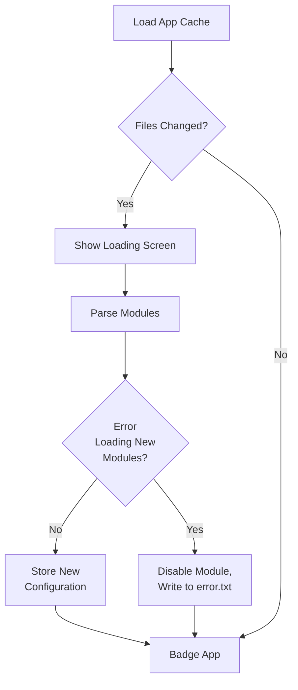

# Architecture Diagrams

## Module/App Design Constructors

- Files (also called modules) in the `apps/` folder will be auto-ingested for potential apps to run
- A module can have multiple apps
- Apps MUST inherit from the base class
- App minimum requirements are very light
- Base App class will provide
    - Automatic app registration (thanks to app directory)
    - Automatic serialization/deserialization of configs 
        - Not required to use, but helps group configs for UI and web based config edits
    - (Not Done) Support for displaying in apps menu with custom icons and names
    - (Not Done) Abstracted registraiton functions for button handling and other hardware based callbacks that can be 
    automatically de-registered as well

## Button Constructs
- Long presses are good for "exiting" context
- Should be used minimally
- Should come up with unified button handling that is mostly outside of app control for existing an app/going back to 
the menu

## Main Startup Sequence
